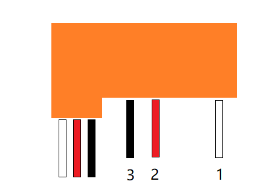

# Flyat-Blyat

Repository for the FlyatBlyat project.

## Electrical
Electrical information for the old and new hardware.

### Battery
Old battery: 9.6V, 500 mAh

New battery: 11.1V, 3000 mAh

### Servos
Servos are driven by 5-6V (From the 4 AA Battery pack). They supply the RC-reciveer at the `Ak` connector.

The nr 1 pin is the PWM signal, pin 2 is the V+ and pin 3 is GND.

### Motor
The old motor were driven directly by the battery voltage, that was 9.6V. Manual testing showed that the motor draws roughly 3 Amps at 10 Volts. (Using the high rated Mosfet 130W)

